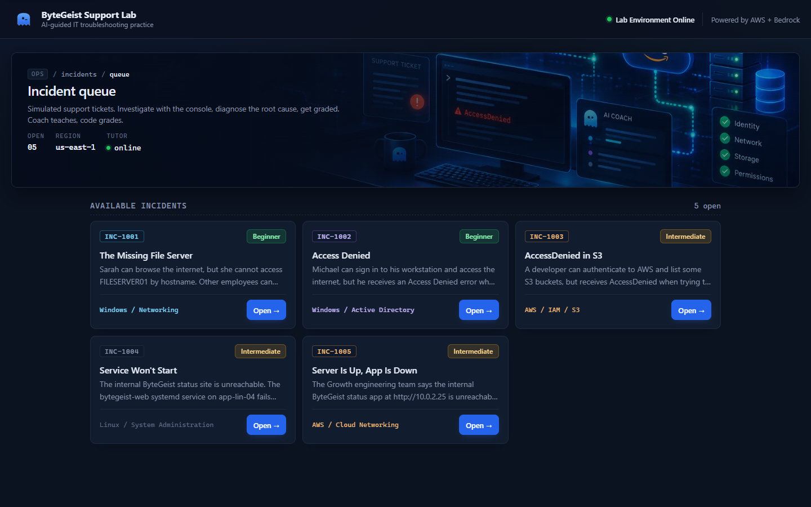
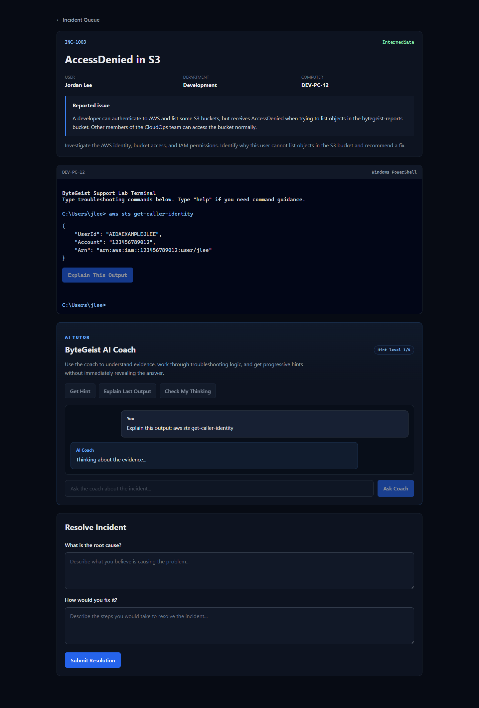
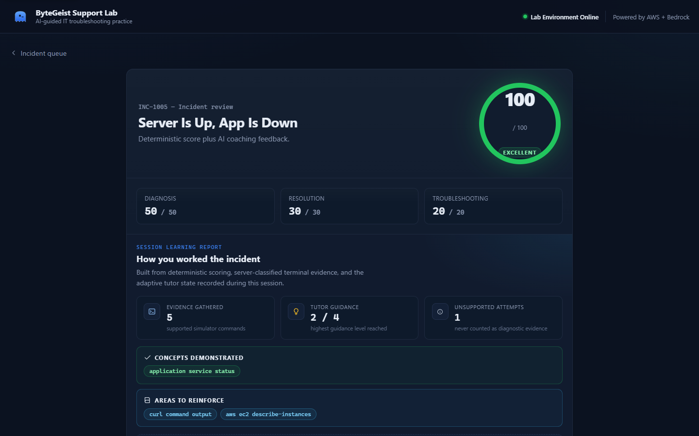
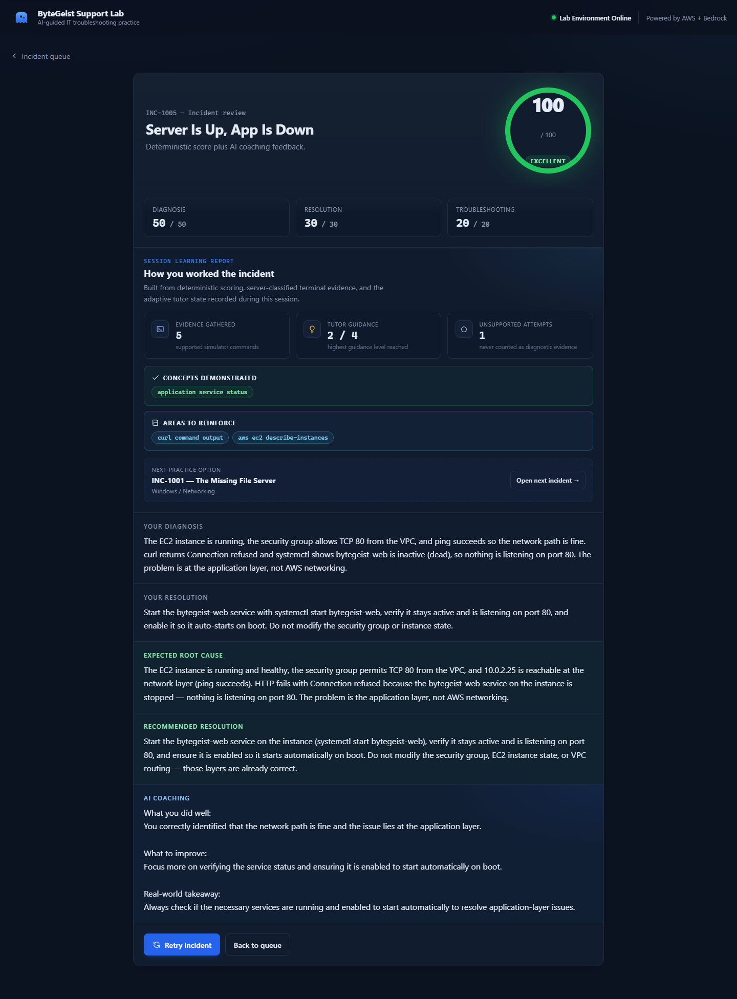
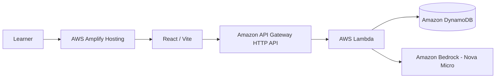

# ByteGeist Support Lab

ByteGeist Support Lab is an AI-guided IT troubleshooting training platform built for the AWS **Zero to Shipped 2026** hackathon.

Learners work through realistic support incidents in a simulated terminal, gather evidence, form a diagnosis, propose a fix, and receive adaptive coaching from Amazon Bedrock.

**Live app:** https://main.dgew3vrz26q4r.amplifyapp.com

**Source:** https://github.com/kcasko/bytegeist-support-lab

**Hackathon category:** Social Good
**Focus track:** Community
**Theme:** Education / workforce development

## Why this exists

Entry-level IT learners often study commands and definitions separately from the reasoning required on a real help desk. ByteGeist turns that gap into a practice environment: the learner gets a ticket, investigates it, and must explain what the evidence means.

The core design rule is:

> **AI teaches. Code grades.**

The AI coach can guide reasoning, explain evidence, correct misconceptions, and escalate hints. It does not control the deterministic score or invent the scenario state.
## What learners can do

- Investigate a support ticket in a simulated Windows or AWS terminal.
- Run scenario-specific troubleshooting commands.
- Ask the AI Coach questions during the investigation.
- Request progressive hints that become more specific without immediately dumping the answer.
- Explain an exact selected terminal result.
- Ask the coach to check both a draft diagnosis and proposed fix.
- Submit a resolution for deterministic scoring.
- Receive final AI coaching based on the actual troubleshooting transcript.
- Retry an incident with a fresh server-side tutoring session.

## Current incidents

| Ticket | Scenario | Domain | Difficulty |
| --- | --- | --- | --- |
| INC-1001 | The Missing File Server | Windows / Networking / DNS | Beginner |
| INC-1002 | Access Denied | Windows / Active Directory / File Shares | Beginner |
| INC-1003 | AccessDenied in S3 | AWS / IAM / S3 | Intermediate |
| INC-1004 | Service Won't Start | Linux / System Administration | Intermediate |
| INC-1005 | Server Is Up, App Is Down | AWS / Cloud Networking | Intermediate |

Each incident reinforces a distinct troubleshooting concept: DNS vs. general reachability (1001), effective group membership vs. share ACLs (1002), authentication vs. IAM authorization (1003), systemd unit state and permissions (1004), and separating infrastructure reachability from application availability (1005).

## Screenshots

### Training queue


### AI Coach during an AWS incident



### Incident review



### Learner performance report



A silent browser walkthrough is stored at:

`docs/demo/bytegeist-support-lab-demo.webm`

## AWS architecture



The backend is deployed with AWS SAM / CloudFormation in `us-east-1`.
### AWS services

- **AWS Amplify Hosting** — public React application.
- **Amazon API Gateway** — HTTP API for scenario, session, terminal, coaching, and scoring requests.
- **AWS Lambda** — Node.js 22 functions for application logic.
- **Amazon DynamoDB** — scenario truth and server-owned tutor sessions.
- **Amazon Bedrock** — Amazon Nova Micro for structured adaptive tutoring and final coaching.
- **AWS CloudFormation / SAM** — infrastructure deployment.

## Tutor architecture

Each incident starts a server-side tutoring session. DynamoDB stores the learner's command transcript, hint level, coach history, concepts demonstrated, concepts needing help, and detected misconceptions.

The browser sends only the learner action and session identifier. The coach Lambda loads the authoritative session and private scenario truth before calling Bedrock.

Bedrock returns a structured tutoring object through Converse tool use. The frontend receives fields such as the coaching message, teaching type, concept, suggested next action, and learner-understanding state.
## Accuracy and anti-hallucination controls

Several controls prevent the AI coach from teaching from invented evidence:

1. Every terminal entry is tagged as a supported simulated command, help output, or unsupported command.
2. Unsupported-command rejection text is explicitly marked as **not diagnostic evidence**.
3. The coach receives the complete list of commands that the current simulator supports.
4. Exact command suggestions must come from that supported list.
5. "Explain This Output" sends the exact selected command/output pair, and the backend verifies it exists in the server-recorded session.
6. Scenario-specific technical rules protect high-value concepts. For the S3 incident, listing objects requires `s3:ListBucket` on the bucket ARN.
7. Deterministic application code controls scoring; Bedrock does not assign the numeric grade.

## Progressive tutoring

Hints use four levels:

1. Broad troubleshooting direction.
2. Relevant evidence category and what to look for.
3. Specific technology or command family.
4. One exact supported next command and what its output should tell the learner.

This makes help progressively more useful while preserving the investigation process.
## Deterministic scoring

Each incident is scored out of 100:

- Diagnosis: **50 points**
- Resolution: **30 points**
- Troubleshooting evidence: **20 points** (up to 4 recommended supported commands, 5 pts each)

The final AI feedback is layered on top of that deterministic result. Unsupported commands are never counted as diagnostic evidence.

## Learner Performance Report

After the deterministic score, each session generates a report drawn entirely from the current session's real state:

- **Evidence gathered** — distinct supported simulator commands actually executed.
- **Tutor guidance** — the highest hint level the learner reached (1..4), sourced from the server session record.
- **Unsupported attempts** — commands the simulator rejected, shown so the learner can see what was tried but never counted as evidence.
- **Concepts demonstrated / Areas to reinforce / Misconceptions detected** — populated only from the adaptive tutor state actually recorded during the session; each section hides gracefully when empty.
- **Next practice option** — surfaces the next scenario from the live queue with one click, wrapping to the first.

The report does not invent learning-state data. Deterministic session metrics are shown separately from adaptive tutor observations, and the wording never implies the AI assigned the score.

## Validation

The live API was regression-tested after every scenario addition.

All five incidents pass a complete smoke test:

- session creation
- supported terminal execution
- unsupported-command rejection
- progressive hint ladder (L1..L4, per-scenario)
- exact-output explanation grounded in server-recorded evidence
- diagnosis/fix coaching via Check My Thinking
- deterministic scoring
- learner performance report
- fresh-session retry

Each incident produces **100/100** on the correct investigation and resolution.

Adversarial tests verify: fabricated evidence is rejected with a 400 error (`selected terminal evidence is not part of this server-recorded session`), unsupported commands are never treated as evidence, S3 listing guidance requires `s3:ListBucket`, and confidently-wrong diagnoses are corrected with a named misconception rather than confirmed.
## Local development

Requirements:

- Node.js 22+
- npm
- AWS CLI v2
- AWS SAM CLI
- AWS credentials / IAM Identity Center session with access to the project account

Frontend:

```powershell
cd frontend
npm install
npm run dev
```

Production frontend build:

```powershell
cd frontend
npm run build
```

Backend:
```powershell
sam build --template-file .\infrastructure\template.yaml

sam deploy `
  --template-file .\.aws-sam\build\template.yaml `
  --stack-name bytegeist-support-lab `
  --resolve-s3 `
  --region us-east-1 `
  --capabilities CAPABILITY_IAM
```

## Repository layout

```text
backend/          Lambda handlers
frontend/         React / Vite application
infrastructure/   SAM template and scenario seeds
docs/             architecture, AWS proof, screenshots, demo, submission copy
```

## Hackathon documentation

- [Architecture](docs/architecture.md)
- [Coding-agent development log](docs/agent-workflow.md)
- [AWS connection / ship-gate evidence](docs/aws-connection.md)
- [Builder Center submission draft](docs/hackathon-submission.md)
