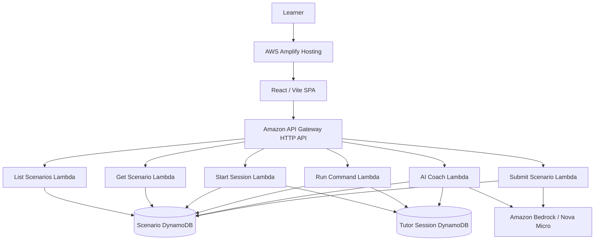

# ByteGeist Support Lab Architecture

## Production URLs

- Frontend: https://main.dgew3vrz26q4r.amplifyapp.com
- API: https://28rhvoyde7.execute-api.us-east-1.amazonaws.com
- Region: `us-east-1`
- CloudFormation stack: `bytegeist-support-lab`

## Architecture

## Data ownership

### Scenario table

`ByteGeistSupportLabScenarios` contains the deterministic scenario truth:

- ticket metadata
- simulated terminal commands and outputs
- recommended investigation commands
- expected diagnosis and resolution
- deterministic scoring keywords

The browser never needs private expected-answer fields during the investigation.

### Tutor session table

`ByteGeistSupportLabTutorSessions` contains per-attempt state:

- session ID and scenario ID
- command history
- coach history
- hint level
- diagnosis / solution state
- concepts demonstrated
- concepts needing help
- detected misconceptions
- timestamps and TTL
## Request flow

1. React loads the incident queue.
2. Opening an incident creates a tutor session.
3. Each terminal command is sent with the session ID.
4. The command Lambda resolves the command against the scenario's supported simulator command map.
5. The command result is recorded server-side with evidence metadata.
6. Coaching requests contain the session ID plus the learner's requested action.
7. The coach Lambda reloads scenario truth and session state from DynamoDB.
8. Bedrock receives authoritative evidence, tutoring rules, the supported command set, and the learner's current state.
9. Bedrock returns structured tutoring data through Converse tool use.
10. Submission scoring is deterministic; final Bedrock feedback explains the result.

## Evidence model

Terminal entries are classified as:

- `simulated` — supported command; output can be diagnostic evidence.
- `help` — command guidance; not diagnostic evidence.
- `unsupported` — simulator rejection; not diagnostic evidence.

This distinction is passed to the AI Coach so a rejected command cannot be interpreted as a successful network, DNS, IAM, or permissions test.
## Exact-output explanations

The frontend exposes an **Explain This Output** action on each terminal entry.

The request sends:

- selected command
- selected output
- current tutor session ID

The coach Lambda verifies that the exact command/output pair exists in the server-recorded session before asking Bedrock to explain it. Other transcript entries are intentionally omitted for that action so the explanation stays tied to the selected evidence.

## Progressive hints

Hint progression is controlled by server-side hint level:

- Level 1: broad reasoning direction.
- Level 2: evidence category and expected signal.
- Level 3: service / technology / command family.
- Level 4: exact next supported command.

The level-four command is selected from scenario-supported commands rather than invented by the model.

## S3 scenario correctness guard

For INC-1003:

- listing objects requires `s3:ListBucket`
- the resource is the bucket ARN: `arn:aws:s3:::bytegeist-reports`
- `s3:GetObject` applies to object ARNs and does not allow bucket listing
- `s3:ListAllMyBuckets` and `s3:GetBucketLocation` are not substitutes for `s3:ListBucket`
## Deployment

The backend is deployed from `infrastructure/template.yaml` with AWS SAM.

The frontend is built with Vite and manually deployed to AWS Amplify Hosting as a static application.

Current Amplify app:

- App name: `bytegeist-support-lab`
- App ID: `dgew3vrz26q4r`
- Production branch: `main`
- Default domain: `dgew3vrz26q4r.amplifyapp.com`

## Validation status

A live smoke test covered all three current scenarios. Each passed:

- session creation
- supported command execution
- exact evidence explanation
- diagnosis/fix check
- 100/100 deterministic score
- fresh retry session

Targeted regressions additionally passed for unsupported evidence, S3 permission correction, and four-level hint progression.
