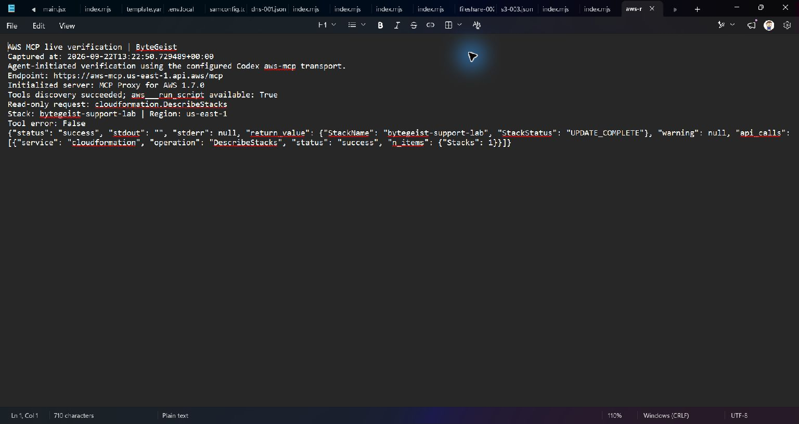

# AWS Connection and Ship-Gate Evidence

This document collects the evidence needed for the AWS Zero to Shipped ship gate.

## Public application

**Live URL:** https://supportlab.casko.dev (custom domain fronting the AWS Amplify deployment below)

The production frontend is hosted by AWS Amplify Hosting.

Verified on September 22, 2026:

- HTTP status: `200 OK`
- Delivery path: Amplify / CloudFront / Amazon S3
- Amplify app: `bytegeist-support-lab`
- App ID: `dgew3vrz26q4r`
- Branch: `main`

## Backend deployment

CloudFormation stack:

`bytegeist-support-lab`

Region:

`us-east-1`

Public API:

https://28rhvoyde7.execute-api.us-east-1.amazonaws.com
Deployed AWS resources include:

- Amazon API Gateway HTTP API
- AWS Lambda functions
- Amazon DynamoDB scenario table
- Amazon DynamoDB tutor-session table
- Amazon Bedrock integration
- AWS Amplify Hosting

The stack was updated successfully through AWS SAM during the final regression cycle.

## Coding-agent AWS connection proof

The hackathon requires documented proof that the AI coding agent was connected to AWS.

**Visual evidence captured on September 22, 2026 (13:22:50 UTC).**



The screenshot is an unedited Windows capture of Notepad displaying the actual stdout from an agent-initiated, read-only verification on ByteGeist. It is a transcript viewer, not a fabricated connection-status screen or a screenshot of the original deployment.

The verification used the existing Codex `aws-mcp` transport configuration:

```text
uvx mcp-proxy-for-aws@latest https://aws-mcp.us-east-1.api.aws/mcp --metadata INSTALL_SOURCE=aws-cli
```

The captured output shows:

- Host `ByteGeist` and the UTC verification timestamp.
- Successful initialization of `MCP Proxy for AWS 1.7.0`.
- Successful tool discovery, including `aws___run_script`.
- A read-only CloudFormation `DescribeStacks` request for `bytegeist-support-lab` in `us-east-1`.
- The real MCP response: `status: success`, stack status `UPDATE_COMPLETE`, and an `api_calls` entry confirming that `DescribeStacks` succeeded and returned one stack.

**Evidence scope:** This proves that the agent could launch the configured AWS MCP transport from the development computer and retrieve the actual project stack through the authenticated AWS MCP service at capture time. The test used a Python MCP client launched by the agent, rather than a native tool call inside a coding-agent connection-status panel. The screenshot does not show the coding-agent UI or AWS Console UI alongside the response, and does not independently prove historical deployment activity or guarantee hackathon acceptance. The visual capture is complete; final ship-gate acceptance remains with the organizers.

## Supporting deployment evidence

Useful terminal/API evidence captured during development:

```text
CloudFormation stack: bytegeist-support-lab
Status: UPDATE_COMPLETE
Region: us-east-1
```

```text
Amplify app: bytegeist-support-lab
App ID: dgew3vrz26q4r
Production branch: main
Deployment status: SUCCEED
```

```text
Public frontend:
https://main.dgew3vrz26q4r.amplifyapp.com

Public API:
https://28rhvoyde7.execute-api.us-east-1.amazonaws.com
```

## Ship-gate checklist

- [x] Application backend runs on AWS.
- [x] Frontend is publicly hosted on AWS.
- [x] Public application URL returns HTTP 200.
- [x] Project uses an AI coding-agent workflow during development.
- [x] Capture visual evidence of the agent-initiated AWS MCP connection test (scope and limitations above).
- [ ] Create / finalize the AWS Builder Center project entry.
- [ ] Confirm final Builder Center submission links to the public app.
- [ ] Select one app category and one focus track.
## Planned submission classification

- App category: **Social Good**
- Focus track: **Community**
- Positioning: practical IT education and workforce-development training

## Screenshots already captured

- `01-incident-queue.png`
- `02-ai-coach-s3.png`
- `03-incident-review.png`

These screenshots demonstrate the public application itself. They do **not** replace the separate coding-agent/AWS-connection proof screenshot required by the hackathon.
